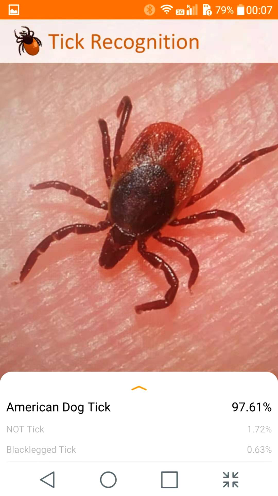
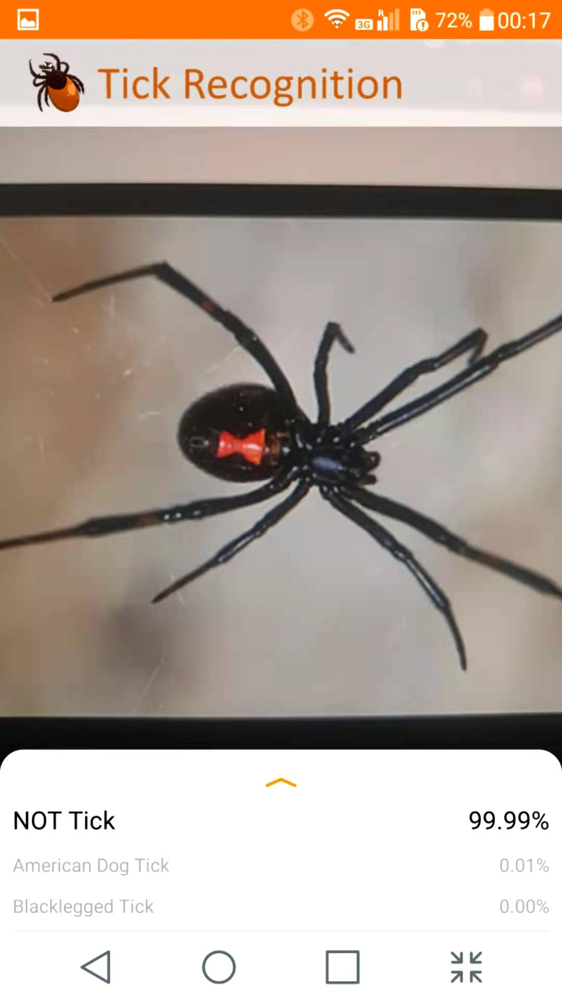

# TickRecognization


## About The Project




### Built With

This section should list any major frameworks that you built your project using. Leave any add-ons/plugins for the acknowledgements section. Here are a few examples.

* [Bootstrap](https://getbootstrap.com)
* [JQuery](https://jquery.com)
* [Laravel](https://laravel.com)


<!-- GETTING STARTED -->

## Getting Started

This is an example of how you may give instructions on setting up your project locally.
To get a local copy up and running follow these simple example steps.

### Installation

1. Get a free API Key at [https://example.com](https://example.com)

2. Clone the repo

   ```sh
   git clone https://github.com/your_username_/Project-Name.git
   ```

3. Install NPM packages

   ```sh
   npm install
   ```

4. Enter your API in `config.js`

   ```JS
   const API_KEY = 'ENTER YOUR API';
   ```


<!-- USAGE EXAMPLES -->


## Contributing

- Proposed a Lightweight convolutional neural network (CNN) model and developed an Android Application with a dynamic UI to display detection results, inference time, and image information utilizing Python, Java, and Android studio.
- Developed a classifier class to preprocess image, recognize images, and get the top K results utilizing TensorFlow Lite APIs.
- Cooperated with the Laboratory of Medical Zoology (LMZ) to collect more than 27,000 unique images and utilized Python and OpenCV to preprocess them by image cleaning, automatic object cutting, images category, etc.
- Addressed overfitting applying regularization with optimal parameters, dropout, and data augmentation utilizing Keras.
- Trained the model on a cloud server to achieve 95% accuracy with an inference speed of 200ms/image on a mobile phone device.

<!-- LICENSE -->

## License

Distributed under the MIT License. See `LICENSE` for more information.

<!-- CONTACT -->

## Contact

Xi Wang xiwang3317@gmail.com
