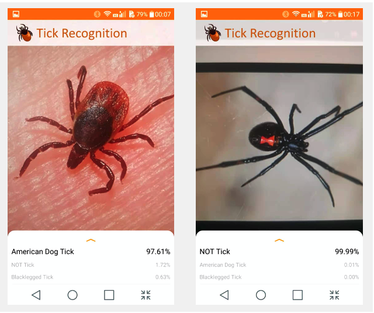

# TickRecognization


## About The Project
This project cooperated with the Laboratory of Medical Zoology (LMZ) to develop a Lightweight convolutional neural network (CNN) model to recognize Tick. And then to develop an real-time application deployed on Android mobile phone.
- This is screenshot from phone.


<!-- GETTING STARTED -->


### Installation
1. Please give a star✨ first😄

2. Clone the repo

   ```sh
   git clone https://github.com/xidaniel/TickRecognization.git
   ```

3. Install Android Studio

4. Generate apk

5. Send apk file to mobile

6. Install apk file on Android phone

7. It is your time to play

<!-- USAGE EXAMPLES -->


## Contributing

- Proposed a Lightweight convolutional neural network (CNN) model and developed an Android Application with a dynamic UI to display detection results, inference time, and image information utilizing Python, Java, and Android studio.
- Developed a classifier class to preprocess image, recognize images, and get the top K results utilizing TensorFlow Lite APIs.
- Cooperated with the Laboratory of Medical Zoology (LMZ) to collect **more than 27,000** unique images and utilized Python and OpenCV to preprocess them by image cleaning, automatic object cutting, images category, etc.
- Addressed overfitting applying regularization with optimal parameters, dropout, and data augmentation utilizing Keras.
- Trained the model on a cloud server to achieve **95%** accuracy with an inference speed of **200ms/image** on a mobile phone device.

<!-- LICENSE -->

## License

Distributed under the MIT License. See `LICENSE` for more information.

<!-- CONTACT -->

## Contact

Xi Wang xiwang3317@gmail.com
